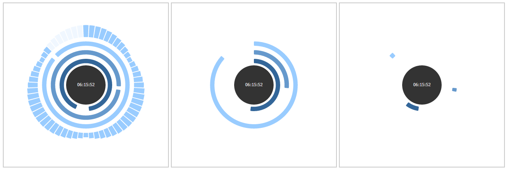
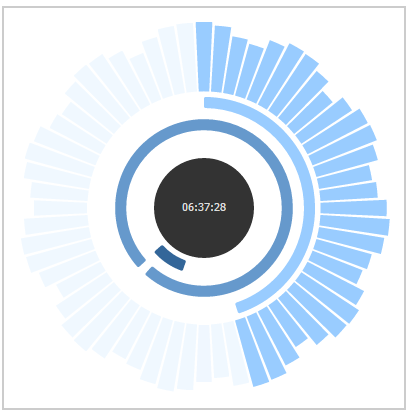

ArcClock
===
ArcClock is an abstract, polar clock library that is simple to deploy, customize and use in your web pages. Its only dependency is D3.



Usage
---
ArcClock will work out-of-the-box with a nice blue theme. See image above.
```
<html>
<head>
<script src="WHERE_YOUR_D3_JS_IS_LOCATED"></script>
<script src="aclock.js"></script>
</head>
<body>
<div style="width:300px;height:300px" id="clock1"></div>
</body>
<script>
  var configuration = {}; // Use default
  var clock1 = new ArcClock(configuration); // Init
  clock1.render('#clock1'); // Start render loop
</script>
</html>
```
Additional configuration and styles can be passed into the configuration object.

Configuration
---
ArcClock's configurations consist of the following areas
- Distance configuration: Calculate the polar position of the hour, minute, second, and wave visuals. Note the distances are proportional distances away from the center, ArcClock will calculate the concrete distances once it has been initialized.
- Colour configurations: Colours of the various elements
- Visibility toggles: Whether to show/hide elements. By default everything is shown.
- Styles: For hour/minute/seconds, you can pick one of ENCLOSURE, ARC or TICK styles, corresponding to the sample image above. In additional you can configure the number of cyclical waves.

For example a configuration like this one below:
```
var clock3 = new ArcClock({
  hourStyle: 'TICK',
  minuteStyle: 'ENCLOSURE',
  secondStyle: 'ARC',
  showCenter: true,
  showWave: true,
  waves: 11.25,
  waveInner: 210,
  waveOuter: 300
});
```
Will result in


